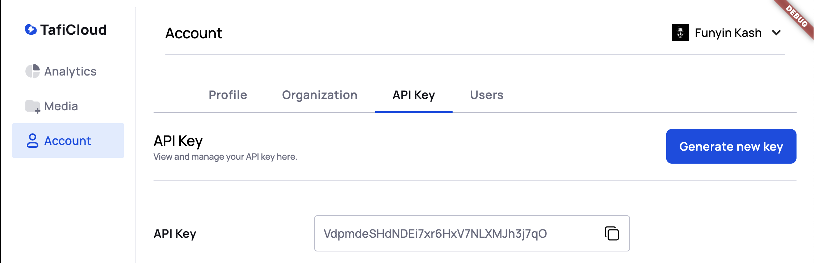

## What is Taficloud

Taficloud offers an affordable, developer-friendly cloud storage solution that combines the versatility of Amazon S3 buckets with the simplicity of a regular file directory.
It also integrates AI-powered features, making it easy to manage and secure user-generated content like photos and videos.

Built on reliable and secure infrastructure, Taficloud offers a powerful, intuitive, and cost-effective object storage service.
With Taficloud's client SDKs, you can easily store images, audio, video, or other user-generated content.
On the server side, use the Taficloud SDKs to manage organizations, generate download links, and leverage Taficloud APIs to access your files.

## Implementation Steps

* Create and account on the [Taficloud dashboard](https://dashboard.taficloud.com)
* Get your [API Key](https://dashboard.taficloud.com/account/api-key)
* Use an [SDK]() of your choice (with the api key)
* Upload files on the client side and get the file Url within your system. ([See Examples]())

<Steps>
    <Step title="Create and account">
        Head on to <a href="https://dashboard.taficloud.com">dashboard.taficloud.com</a> to create an Account
    </Step>
    <Step title="Generate API Key">
        
    </Step>
    <Step title="Use and SDK of your choice">
        Choose from our list of supported environments and languages. Remember to securely include your API Key
    </Step>
    <Step title="Upload or Download Files">
        Use the upload or download functions of our SDK to manage your files within <Tooltip tip="Check out examples">your system.</Tooltip>
    </Step>
</Steps>

## SDKs

Update your docs to your brand and add valuable content for the best user conversion.

<CardGroup cols={2}>
    <Card
        title="Mobile"
        icon="mobile"
        href="sdks/mobile/android/setup">
        Use the Taficloud SDK on your android and ios apps
    </Card>
    <Card
        title="Web"
        icon="code"
        href="sdks/web/vue/setup">
        Use the Taficloud SDK on websites
    </Card>
    <Card
        title="Backend"
        icon="server"
        href="sdks/backend/jvm/setup">
        Jvm environment
    </Card>
    <Card
        title="REST API"
        icon="diagram-project"
        href="rest/setup">
        Plain Simple Open APi Docs
    </Card>
</CardGroup>
